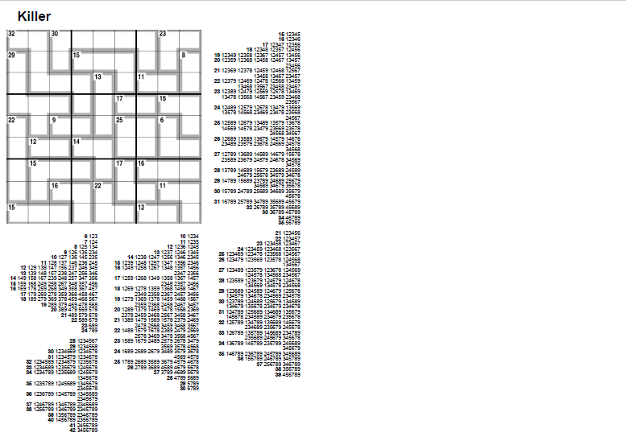

# Guardian Killer Sudoku helper

Take a Killer Sudoku from the Guardian website and print it ous with all the number combinations to help you.

The easiest way to use it is to set up a bookmarklet like this:

    'javascript:void(window.open('http://url.of.this.service/?url=' + location.href));'

then navigate to a killer sudoku page, for example https://www.theguardian.com/lifeandstyle/2024/apr/28/observer-killer-sudoku and click the bookmarklet.